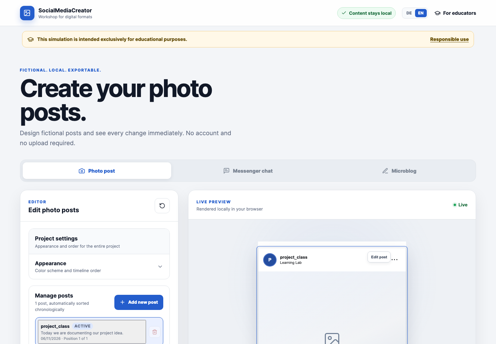
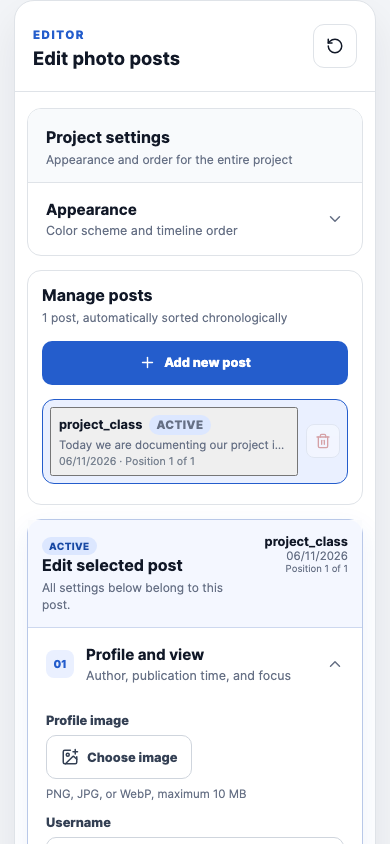

# SocialMediaCreator

SocialMediaCreator is a browser-based educational workshop for creating
fictional social-media posts, conversations, and timelines. It is designed for
media literacy lessons, source criticism, communication analysis, and classroom
discussion about manipulated digital content.

[Open the live application](https://smc.haak3.de)

> SocialMediaCreator is a simulation for educational use. It does not reproduce
> or connect to a real social-media platform.

## Product overview





The application currently provides three simulation modules:

- **Photo Post** creates chronological feeds with profiles, captions,
  reactions, comments, replies, image carousels, and simulated video
  thumbnails.
- **Messenger Chat** creates two-sided conversations with two fictional
  profiles, custom timestamps, online states, and seen indicators.
- **Microblog** creates independent feeds or connected threads with profiles,
  reactions, comments, and replies.

Shared capabilities include:

- Light, Dim, and Dark themes
- German and English interfaces
- responsive live previews
- chronological timelines with newest-first or oldest-first ordering
- dedicated comment views
- PNG, JPG, and A4 PDF export
- mandatory visible simulation labels on every exported result
- local project archive import and export, including optimized images
- accessible keyboard navigation and mobile editor/preview switching

## Educational and safety model

The application uses fictional default profiles and clearly labels the
generator and every exported result as a simulation. Before image or PDF
export, users must acknowledge the educational purpose and terms of use.

PNG and JPG exports also contain a locally verifiable origin marker. The
verification page can identify an intact marker or detect subsequent byte-level
changes. This marker is an educational provenance hint, not cryptographic proof
that an image is authentic or unmodified in every possible sense.

Guidance for educators, responsible-use recommendations, terms of use, privacy
information, and the legal notice are available from the application footer.

## Privacy and local processing

Post content, uploaded images, and project configurations are processed in the
browser. The application has no user accounts, content database, or server-side
storage for created simulations.

Images are represented by local object URLs. Saved `.smc` project archives
include WebP-optimized copies of the active module's images. Archive creation
and loading happen locally. The selected language and export acknowledgement
are stored in `localStorage`.

The production site is served through Cloudflare Workers and uses Cloudflare
Web Analytics. Cloudflare therefore processes technical connection and
statistical data as described in the
[privacy policy](https://smc.haak3.de/datenschutz).

## Project files

The primary project format is a ZIP-compatible **SMC archive version 1**:

- stores the active module's Config V6 data and optimized images
- limits source images to 5 MB and 4096 pixels per edge
- stores images at a maximum edge of 2048 pixels, normally as WebP with PNG
  fallback where browser WebP encoding is unavailable
- limits total uncompressed project data to 25 MB
- rejects unknown, unsafe, oversized, or invalid entries before replacing state
- imports Config V5 projects and migrates them to German Config V6 projects
- continues to import image-free Config V6 JSON files

The complete format and validation contract is documented in
[Project archive format](docs/PROJECT-ARCHIVE.md).

## Local development

### Requirements

- Node.js `>=22.12.0 <23`
- npm `>=10 <11`

### Setup

```bash
npm ci
npm run dev
```

Vite prints the local development URL after startup.

Playwright browsers are required before running the E2E suite for the first
time:

```bash
npx playwright install chromium firefox webkit
```

## Commands

| Command | Purpose |
| --- | --- |
| `npm run dev` | Start the Vite development server |
| `npm run build` | Type-check and create the production bundle |
| `npm run preview` | Serve the production bundle locally |
| `npm test` | Run unit and component tests with Vitest |
| `npm run lint` | Run ESLint |
| `npm run test:e2e:chromium` | Run the fast Chromium-only Playwright suite used by CI |
| `npm run test:e2e` | Run Playwright tests in Chromium, Firefox, and WebKit |
| `npm run verify` | Run tests, lint, build, and the complete E2E suite |
| `npm run deploy` | Deploy the static application with Wrangler |
| `npm run smoke:production` | Validate the production deployment |

To smoke-test another deployment:

```bash
npm run smoke:production -- https://example.workers.dev
```

## Architecture and stack

SocialMediaCreator is a static single-page React application. Module state and
uploaded image references remain in browser memory. Markdown content pages are
bundled at build time, and exports are rendered from the same preview
components used by the editor.

The source tree is organized by responsibility:

```text
src/
  app/          application shell, routing, dialogs, project image lifecycle
  features/     Photo Post, Messenger, Microblog, and verification modules
  shared/       reusable editor components and browser-side utilities
  domain/       serialized state types, defaults, and field constraints
  i18n/         typed German and English dictionaries and locale provider
  content/      bundled Markdown pages
  styles/       ordered base, preview, content, and responsive layers
```

Core technologies:

- React 19 and TypeScript
- Vite
- Vitest and Testing Library
- Playwright
- `html-to-image` and jsPDF
- React Markdown
- Cloudflare Workers Static Assets

The production deployment uses a single-page-application fallback and hardened
security and caching headers from `public/_headers`.

## Documentation

- [Changelog](CHANGELOG.md)
- [Coding plan](docs/planning/Codingplan.md)
- [UI and UX plan](docs/planning/UI-Design-Entwurf.md)
- [Cloudflare deployment](docs/CLOUDFLARE.md)
- [Project archive format](docs/PROJECT-ARCHIVE.md)
- [Software stack audit](docs/STACK-AUDIT.md)
- [Educational and transparency concept](docs/planning/BILDUNGS-UND-TRANSPARENZKONZEPT.md)

## License

SocialMediaCreator is licensed under the
[GNU General Public License v3.0 only](LICENSE).
