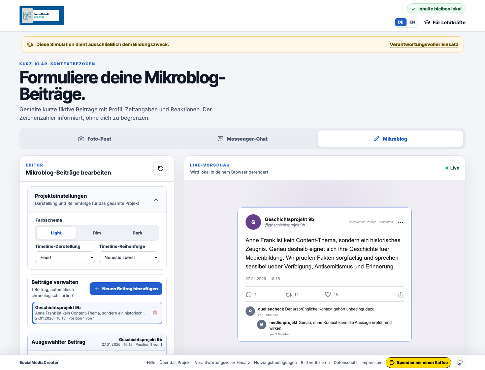

# Beispielprojekt: Anne Frank im schulischen Social-Media-Format

Dieses Beispiel zeigt, wie SocialMediaCreator in einem schulischen Kontext
eingesetzt werden kann. Das Thema wird nicht als Werbekampagne behandelt,
sondern als medienpaedagogisches Unterrichtsprojekt zur historischen
Einordnung, Quellenkritik und verantwortungsvollen Sprache.

## Unterrichtskontext

Eine 9. Klasse arbeitet in einer Projektwoche zu Anne Frank,
Nationalsozialismus, Antisemitismus und Erinnerungskultur. Die Schuelerinnen
und Schueler erstellen fiktive Social-Media-Beitraege, um zu ueben, wie
historische Inhalte praezise, respektvoll und plattformgerecht aufbereitet
werden koennen.

Ziel ist nicht Reichweite, sondern Verantwortung: Fakten pruefen, Begriffe
sorgfaeltig waehlen, keine Leidensgeschichte dramatisieren und keine
Originalzitate aus urheberrechtlich geschuetzten Texten uebernehmen.

## Screenshot

## Beispiel: Instagram-Carousel

**Slide 1**  
Anne Frank: Mehr als ein Name aus dem Geschichtsbuch

**Slide 2**  
Anne Frank wurde 1929 in Frankfurt am Main geboren. 1934 floh ihre Familie vor
den Nationalsozialisten in die Niederlande.

**Slide 3**  
Ab 1942 versteckte sich die Familie in Amsterdam. Das Versteck wurde 1944
entdeckt.

**Slide 4**  
Anne Frank starb 1945 im Konzentrationslager Bergen-Belsen.

**Slide 5**  
Ihr Tagebuch wurde nach dem Krieg veroeffentlicht und ist bis heute ein
wichtiges Zeugnis juedischen Lebens und nationalsozialistischer Verfolgung.

**Slide 6**  
Frage an uns heute: Wie sprechen wir ueber Geschichte, ohne sie zu
vereinfachen?

**Caption**  
Anne Franks Geschichte zeigt, was Ausgrenzung, Antisemitismus und Diktatur fuer
einzelne Menschen bedeuten. In unserem Unterrichtsprojekt geht es darum,
historische Fakten sorgfaeltig zu pruefen und respektvoll zu vermitteln.
Erinnerung beginnt nicht mit grossen Worten, sondern mit Genauigkeit.

**CTA**  
Welche Verantwortung haben wir, wenn wir historische Themen oeffentlich teilen?

## Beispiel: LinkedIn-Post fuer die Schule

Wie kann Geschichtsunterricht digitale Medien sinnvoll nutzen?

In unserer Projektwoche beschaeftigen sich Schuelerinnen und Schueler mit Anne
Frank und der Frage, wie Erinnerungskultur heute kommuniziert werden kann. Dabei
erstellen sie kurze Social-Media-Beitraege, pruefen historische Fakten und
reflektieren, welche Sprache bei sensiblen Themen angemessen ist.

Der Fokus liegt nicht auf Reichweite, sondern auf Verantwortung: praezise
recherchieren, respektvoll formulieren, keine Leidensgeschichten dramatisieren.

Das Projekt verbindet Geschichtsunterricht, Medienbildung und ethische
Kommunikation.

## Beispiel: Mikroblog-Post

Anne Frank ist kein Content-Thema, sondern ein historisches Zeugnis. Genau
deshalb eignet sich ihre Geschichte fuer Medienbildung: Schuelerinnen und
Schueler lernen, Fakten sorgfaeltig zu pruefen und sensibel ueber Verfolgung,
Antisemitismus und Erinnerung zu sprechen.

## Blogpost-Abschnitt

Das Beispiel zeigt, wofuer SocialMediaCreator im schulischen Kontext nuetzlich
ist: Aus einem Thema entsteht nicht einfach ein einzelner Post, sondern ein
konsistentes Kommunikationsset fuer verschiedene Plattformen. Lehrkraefte
koennen Varianten vergleichen, Sprache anpassen und gemeinsam mit der Klasse
diskutieren, welche Formulierungen angemessen sind.

Der wichtigste Punkt: Das Tool ersetzt keine historische Einordnung. Es hilft
dabei, die Ergebnisse sauber zu strukturieren und mediengerecht aufzubereiten.
